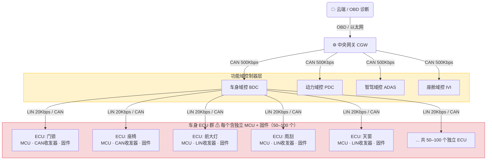
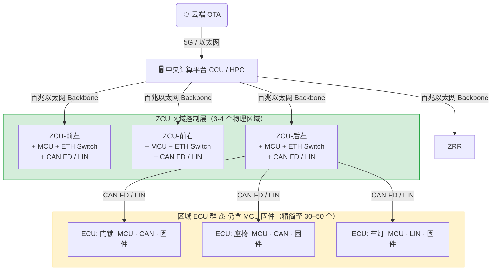
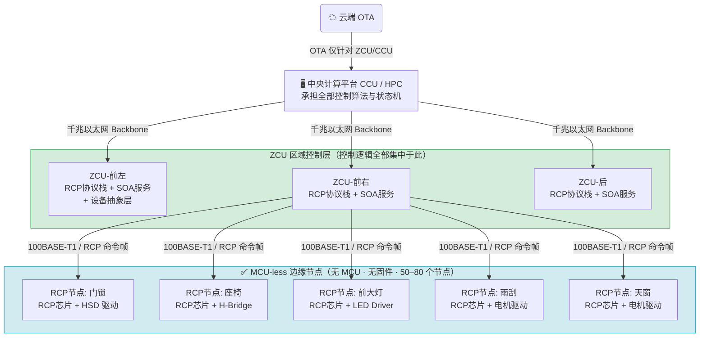
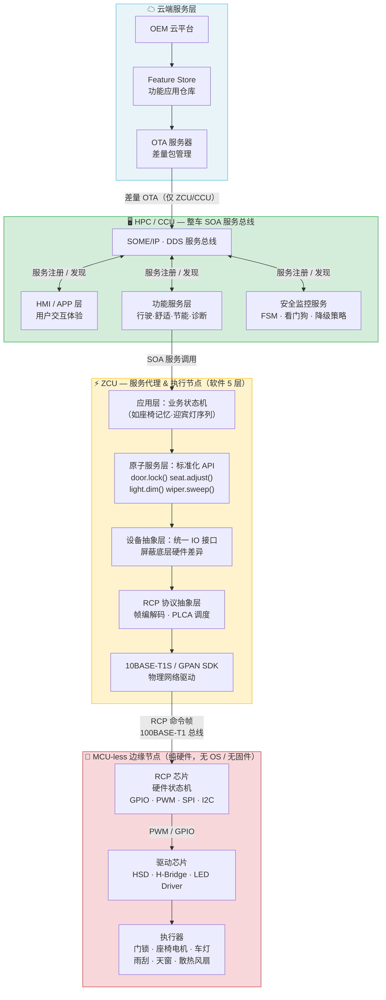
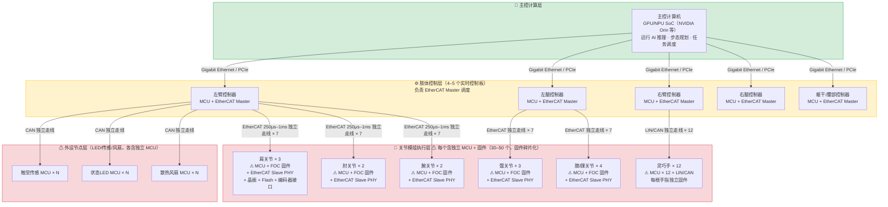
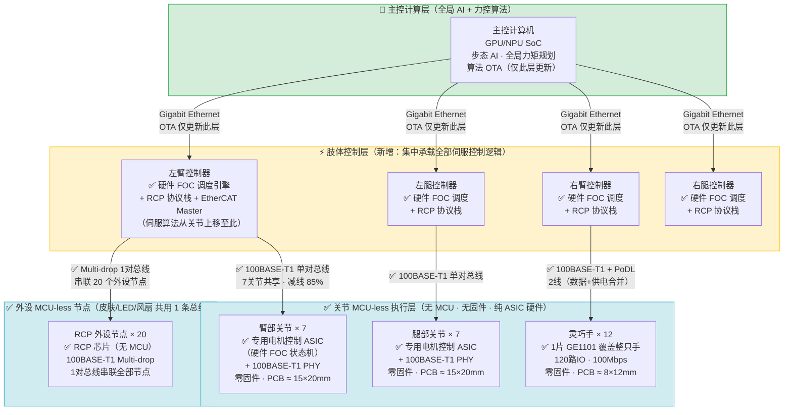

# MCU-less 技术趋势深度分析

> 基于jiaruo'知识库 27 个 MCU-less 相关来源，从车载控制器设计、EE 架构革新、成本、布置、线束五大维度，系统分析 MCU-less 技术在汽车领域和机器人领域应用的现状、价值、挑战与未来趋势。
>
> **撰写日期**：2026-04-28 | **数据基准**：2024–2026 年公开资料
---


## 1.背景：MCU-less 为何成为趋势

### 1.1 传统分布式 ECU 的系统性困境

过去三十年，汽车电子电气架构（EEA）遵循"功能独立 ECU"原则不断堆叠，积累了深层次的系统性矛盾：

| 矛盾维度 | 具体表现 | 量化数据 |
|---|---|---|
| **硬件冗余** | 每个功能独立 MCU + 外围电路，大量重复 | 整车 ECU 数量 50-100 个 |
| **线束成本** | 点对点布线，线束迂回冗长 | 线束总长 1500-2000m，占整车成本显著比例 |
| **OTA 困难** | 分散 MCU 各有独立固件，需逐一刷写 | 单车型 OTA 节点 50-100  |
| **TTM 延长** | 新功能需硬件改版，开发周期长 | 新功能开发周期 12–24 个月 |
| **安全攻击面** | 分散接口缺乏集中防护，入侵路径多 | 攻击面随 ECU 数量线性增长 |

### 1.2 区域化架构（ZCU）作为过渡

2020 年前后，业界引入"中央计算+区域控制"EEA 3.0 架构，以 ZCU（Zone Control Unit）汇聚物理区域内的 ECU，通过以太网连接中央计算平台（CCU），ZCU 架构的市场渗透验证了这一方向：

> **中国市场（2024，佐思汽研）**：ZCU 渗透率 **8.83%**，搭载量超 **200 万辆**，市场规模 39.3 亿元。

但 ZCU 本身仍包含独立 MCU，控制逻辑并未真正集中。MCU-less 是 ZCU 路线的"最后一公里"——将边缘节点的 MCU 彻底移除，控制逻辑全部上移至 ZCU/CCU。

---

### 1.3 MCU-less 技术本质：双重解耦

MCU-less 的核心价值不仅是"去掉一颗 MCU"，而是实现两个层面的解耦：

```
[软硬解耦]  硬件标准化 + 功能软件化 → 支持 OTA 升级而无需硬件改版
[软软解耦]  应用逻辑 ⊥ 通信协议栈 → 微服务化部署，通过标准接口调用边缘 IO
```

**技术本质**：
- 边缘节点仅保留 **MCU-less 芯片（硬件状态机）+ 驱动芯片（HSD/H-Bridge/LED Driver）**
- MCU-less 芯片内部无操作系统、无应用程序，通过硬件电路直接执行 ZCU 下发的 GPIO/PWM/SPI/I2C 指令
- ZCU/CCU承担所有控制逻辑和状态机，形成完全集中式控制

---

### 1.4 四大技术流派对比分析

目前业界形成三条差异化的 MCU-less 技术路线，各有适用场景：

#### 1.4.1 技术路线全景对比

| 维度 | 10BASE-T1S + RCP | 100BASE-T1 + RCP | CAN FD Light | UART over CAN |
|---|---|---|---|
| **物理层标准** | IEEE 802.3cg（2020）| IEEE 802.3bw | CAN FD 简化版 | 复用 CAN 物理层 |
| **速率** | 10 Mbps，半双工 | 100Mbps, 全双工 |500 Kbps–2 Mbps | 取决于 CAN 物理层（2 Mbps）|
| **拓扑** | Multi-drop（多节点总线）| 菊花链/环网 | 总线 | 总线 |
| **节点数** | 最多 255（典型 8–30）| 60个 |多节点 | 多节点 |
| **延迟特性** | 确定性（PLCA 时分复用）| 确定性（时分复用）|低（帧结构简单）| 低（透传）|
| **成本** | 中（MAC+PHY 约十几元 RMB）| 10+RMB |低（几毛到几元）| 低（改造成本低）|
| **IO 控制协议** | RCP（宝马主导，TC18 草案）| 厂商自定义 | 厂商自定义 | 厂商自定义 |
| **代表芯片** | ADI AD3304、Onsemi T30HM1TS3600、Microchip LAN8660| 汇顶 GE1101 | ST 1991dlh32 | Infineon 相关方案 |
| **量产状态** | ADI 宝马量产；其他样片/预研 | 27Q3量产  |ST 已量产 | TI/Infineon 方案已有应用 |
| **适用场景** | 新平台，追求高带宽和确定性延迟 | 新平台，追求高带宽和确定性延迟 | 超低成本，车灯/简单执行器 | 存量 CAN 平台改造 |
| **标准化成熟度** | 物理层成熟，RCP 草案阶段 | 物理层成熟，厂商私有 | 成熟 | 无标准，厂商私有 |

#### 1.4.2 关键 MCU-less 芯片选型对比

| 厂商 | 型号 | IO 数 | 速率 | 延迟 | 单价（参考）| 量产状态 |
|---|---|---|---|---|---|---|
| **ADI** | AD3304（E2B）| 12 | 10 Mbps | <1 ms | ~$1.3 | **量产**（宝马氛围照明）|
| **ADI** | AD3301/AD3305 | 12 | 10 Mbps | <1 ms | ~$1.3 | 量产 |
| **Onsemi** | T30HM1TS3600 | 10 | 10 Mbps | <1 ms | — | 样片 |
| **Onsemi** | T30HM1TS3610 | 20 | 10 Mbps | <1 ms | — | 样片 |
| **Microchip** | LAN8660 | 16 | 10 Mbps | — | — | 开发阶段 |
| **汇顶 GPAN** | GE1101 | 120/45 | **100 Mbps** | ~50 μs | **~14 RMB** | 预计 2026Q3 样品 |
| **ST** | 1991dlh32 | — | 500K–2M（CAN FD）| 低 | 低 | 量产 |

> **关键差异**：汇顶 GE1101 在速率（100 Mbps vs 10 Mbps）、IO 数量（120 路 vs 12–20 路）、延迟（50 μs vs <1 ms）上具有显著优势，且本土价格更具竞争力。

---
## 1.MCU-less 技术在车载领域的应用价值

### 2.1车载控制器设计维度分析

#### 2.1.1 硬件架构革命

**传统 ECU 六大模块 → MCU-less 极简两模块**：

```
传统ECU节点：MCU + 晶振 + 复位电路 + 存储器(Flash/EEPROM) + 电源管理 + 通信收发器 + 驱动芯片（HSD/H-Bridge/LED Driver）
                          ↓ MCU-less
MCU-less 节点：RCP 芯片（含 MAC-PHY + 硬件状态机）+ 驱动芯片（HSD/H-Bridge/LED Driver）
```

**量化收益**：

| 指标 | 传统 ECU | MCU-less 节点 | 节省幅度 |
|---|---|---|---|
| 节点 BOM 成本 | $15–25 | $8–12 | **约 40%** |
| PCB 面积 | 25×35 mm | 15×20 mm | **约 51%** |
| 设计复杂度 | MCU 选型 + 固件开发 + RTOS | 仅硬件配置，无固件 | 显著降低 |
| 固件开发工作量 | 每节点需独立固件 | **零固件**（硬件状态机）| 100% 消除 |
| OTA 节点数 | 随 ECU 数量线性增长 | 仅 ZCU/CCU 需 OTA | 减少 80%+ |

#### 2.1.2 功能安全设计约束

MCU-less 并非万能，功能安全等级是核心约束：

| 应用域 | MCU-less 适用性 | 原因 |
|---|---|---|
| 车身域（门锁/座椅/照明/雨刮）| ✅ **强烈推荐** | 控制逻辑简单，无本地安全计算需求 |
| 智能电源域 | ✅ **推荐** | 电源路由逻辑可由硬件承担 |
| 热管理系统 | ✅ **可用** | 多执行器协调，逻辑可上移 |
| 底盘气悬域 | ⚠️ **不推荐** | 本地控制算法复杂，域控 CPU +10% 负载 |
| 制动/转向/气囊（ASIL-D）| ❌ **禁止** | 必须本地降级（Fallback），MCU 不可去除 |

**结论**：MCU-less 的适用范围是**车身舒适域（Body Domain）**，ASIL-B 以下场景；ASIL-D 功能安全系统必须保留本地 MCU 作为降级保障。

---

### 2.2 EE 架构革新维度分析

#### 2.2.1 架构演进路线图

```
EEA 1.0/2.0  →  EEA 3.0  →  EEA 3.x（MCU-less）→  EEA 4.0（全软件定义）
分布式 ECU       ZCU 区域控制    ZCU+MCU-less节点       中央 AI + MCU-less节点
（100–150 ECU）  （20–30 ZCU）   （边缘纯 IO 芯片）     （概念阶段）
```

#### 2.2.2 从"功能域"到"物理区域+服务化"的范式转变

MCU-less 强制推动整车软件架构从"ECU 粒度"升级到"服务粒度"：

**ZCU 软件 5 层架构**（以 GPAN 方案为例）：
```
应用层（应用逻辑，如座椅控制状态机）
    ↕
原子服务层（标准化服务接口，对外暴露 API）
    ↕
设备抽象层（屏蔽底层硬件差异）
    ↕
RCP 抽象层（统一 RCP 协议操作接口）
    ↕
GPAN/100BASE-T1 SDK（物理网络驱动）
    ↕
[边缘 RCP 节点：纯硬件执行]
```

这与小鹏 XEEA3.5 的 **300+ 原子化服务**（SOA）理念完全一致，实现了真正的"功能上移、硬件下沉"。

#### 2.2.3 与 SDV（软件定义汽车）战略的对齐

| SDV 核心诉求 | MCU-less 如何支撑 |
|---|---|
| OTA 功能迭代 | 边缘零固件 → OTA 复杂度从"整车百节点"降至"ZCU/CCU 数节点" |
| 功能按需订阅 | ZCU 侧软件控制 → 同一硬件平台可动态激活不同功能 |
| 软硬件解耦 | RCP 芯片标准化 → 更换 ZCU 软件不影响边缘硬件，反之亦然 |
| 快速迭代 | 边缘无软件 → 新功能仅需 ZCU 侧软件升级，无需重新认证边缘固件 |

#### 2.2.4 EEA 架构对比图：传统分布式 → ZCU → MCU-less

> 以下三张架构图展示了整车 EEA 从 2.0 到 3.x 的完整演化脉络，聚焦边缘节点的结构变化。

##### ① 传统 EEA 2.0 — 分布式 ECU 架构



**特征**：线束 1.5-2 km+，ECU 50–100 个，每节点独立固件，OTA 涉及全车 50-100 节点，TTM 12–24 个月

---

##### ② EEA 3.0 — ZCU 区域架构（当前主流）



**特征**：线束缩短约 30%，ECU 精简至 30–50 个，ZCU 承担部分汇聚功能，但边缘 MCU 仍存在

---

##### ③ EEA 3.x — MCU-less 区域架构（2025–2028 导入）



**特征**：线束减重 50–60%，边缘节点零固件，OTA 仅需刷新 ZCU/CCU，PCB 缩小 51%，节点 BOM 节省 40%

---

#### 三代架构关键指标对比

| 指标 | EEA 2.0 分布式 | EEA 3.0 ZCU | EEA 3.x MCU-less |
|---|---|---|---|
| ECU/节点数 | 50–100 个 | 30–50 个 | 50–80 个 RCP 节点（无 MCU）|
| OTA 节点数 | 50–100 | 30–50 | **仅 4–8 个 ZCU/CCU** |
| 线束总长 | ~5 km | ~3.5 km | **~2 km（减 60%）**|
| 边缘固件数量 | 50–100 套 | 30–50 套 | **0（零固件）**|
| 新功能 TTM | 12–24 个月 | 8–15 个月 | **3–6 个月（仅改 ZCU 软件）**|
| 整车 BOM 节省 | 基准 | −15% | **−30%（对比 2.0）**|

---

#### 2.2.5 MCU-less 使能的 SOA 软件架构图

MCU-less 不仅是硬件简化，更是推动软件架构从"ECU 粒度固件"升级为"服务粒度 SOA"的关键使能器。



**架构解读**：

| 层级 | 角色 | 关键特征 |
|---|---|---|
| **云端** | 功能仓库 + OTA 管理 | Feature Store 支持按需下发/订阅功能 |
| **HPC/CCU** | SOA 服务总线主机 | SOME/IP 或 DDS，服务注册/发现/调用 |
| **ZCU** | 服务代理 + 执行节点 | 5 层软件栈，承担本区域全部控制逻辑 |
| **MCU-less 节点** | 纯硬件 IO 执行器 | 零 OS，零固件，仅响应 RCP 命令帧 |

> **核心价值**：任何新功能（如新增座椅按摩模式）只需在 ZCU 应用层增加一个原子服务，通过 OTA 更新 ZCU 软件即可，**无需触碰硬件，无需重新认证边缘固件**，实现真正的软件定义汽车。

---

### 2.3 成本维度分析

#### 2.3.1 节点级成本节省（单节点）

| 成本项 | 传统 ECU | MCU-less | 节省 |
|---|---|---|---|
| MCU 芯片 | $3–8 | $0 | $3–8 |
| 晶振 | $0.3–0.5 | $0（RCP 芯片内置时钟）| $0.3–0.5 |
| Flash/EEPROM | $0.5–1.5 | $0（可选外置 EEPROM）| $0.5–1.5 |
| LDO/电源管理 | $1–3 | $0–0.5（部分集成）| $0.5–3 |
| CAN/LIN 收发器 | $0.5–1.5 | $0（集成或替换）| $0.5–1.5 |
| PCB 面积成本 | $2–5 | $1–2.5 | $1–2.5 |
| **合计 BOM** | **$15–25** | **$8–12** | **~$7–13（约 40%）**|

#### 2.3.2 整车级成本节省（综合估算）

基于 GPAN BZCU 座椅项目实测数据（3 个 ZCU 节点）：

| 节省项目 | 节省金额 |
|---|---|
| MCU 本体 + 晶振/Flash/LDO/去耦电路 | **141 元/套（3 节点）** |
| 分布式功放（音频路由改由 TDM 硬件承担）| **300 元/套** |
| 三级网络 BOM 节约 | **20 元/车** |
| 48V 分布式音频替代方案 | **315 元/车** |
| **综合估算节省** | **~476 元/车（硬件）+ 开发维护成本降低** |

#### 2.3.3 隐性成本节省（难以直接量化）

- **OTA 失败成本归零**：边缘节点无固件，不存在 OTA 刷写失败/砖机场景
- **售后返修降低**：固件 Bug 导致的召回风险消除（边缘节点无软件）
- **开发人员成本**：不再需要为每个 ECU 配置嵌入式固件工程师
- **认证成本**：AUTOSAR BSW 层认证仅需在 ZCU 层进行，不在每个边缘节点重复

---

### 2.4 布置（Layout）维度分析

#### 2.4.1 PCB 设计革命

| 指标 | 传统 ECU | MCU-less 节点 |
|---|---|---|
| PCB 尺寸 | 25×35 mm（标准）| 15×20 mm（-51%）|
| 层数需求 | 4–6 层（MCU + 外围）| 2–4 层（简化电路）|
| 元器件密度 | 高（MCU + 晶振 + 复位 + 存储）| 低（RCP 芯片 + 驱动芯片）|
| 调试接口 | JTAG/SWD 调试口（占用 PCB 空间）| 无需调试口 |

**实际影响**：
- PCB 面积缩减 51% → 控制器模块可嵌入更狭小空间（如车门内板、座椅底部）
- 更薄、更轻的控制器 → 支持"即插即用（Plug & Play）"模块化设计
- 热管理简化：无 MCU 发热源，散热设计要求降低

#### 2.4.2 即插即用（Plug & Play）模块化趋势

MCU-less + 标准化 RCP 协议使控制器模块具备真正意义上的"即插即用"能力：

1. **标准化物理接口**：RCP 芯片统一 IO 定义，不同品牌控制器可互换
2. **零配置启动**：RCP 节点上电后自动被 ZCU 发现和初始化（拓扑发现机制）
3. **动态功能分配**：同一 RCP 节点硬件，ZCU 侧软件可按需配置功能（如今天做门控，明天改配置做雨刮）

> 这与佐思汽研报告中 2025 年 ZCU 六大趋势之"**Plug&Play 模块化平台演进**"高度吻合。

---

### 2.5 线束维度分析

#### 2.5.1 线束简化的量化数据

| OEM | 线束改善数据 |
|---|---|
| **小米 YU7** | 线束减少 **40%** |
| **小鹏 XEEA3.5** | 线束减重 **30%** |
| **行业通用估算** | 线束总重量减少 **50–60%** |

#### 2.5.2 线束简化的技术路径

硬线控制线束 → 通信线束 → 线束整体重量和成本大幅下降。

#### 2.5.3 线束轻量化的整车级价值

- **整备质量降低**：线束减重 10–15 kg（估算）→ 续航里程提升 1–2%（新能源车）
- **装配效率提升**：线束接插件减少 → 总装工时降低
- **可靠性提升**：接插件数量减少 → 接触不良/氧化故障点减少

---

### 2.6 风险分析

#### 2.6.1 技术成熟度风险

| 风险项 | 等级 | 说明 |
|---|---|---|
| **RCP 标准未定** | 🔴 高 | IEEE TC18 Draft 0.2，标准 2026–2027 年内预计完成，但厂商实现存差异（ADI vs Onsemi 协议栈不兼容）|
| **10BASE-T1S 生态不成熟** | 🟡 中 | 与 CAN 相比，调试工具链、示波器支持、分析仪均不完善 |
| **100BASE-T1 量产延迟风险** | 🟡 中 | 汇顶 GE1101 原计划 2026 Q2，已延至 Q3，芯片研发进度不确定性高 |
| **实时性边界条件** | 🟡 中 | PLCA 在极端负载下的最坏情况延迟尚未在量产车中大规模验证 |

#### 2.6.2 成本风险

| 风险项 | 等级 | 说明 |
|---|---|---|
| **10BASE-T1S 初期成本高** | 🔴 高 | MAC+PHY 十几元 vs CAN 几毛钱，低复杂度节点改造 ROI 为负 |
| **ZCU 成本上升** | 🟡 中 | 控制逻辑集中到 ZCU 导致 ZCU 算力需求提升，ZCU 单价上涨 |
| **底盘气悬域禁用** | 🟡 中 | ASIL-D 场景必须保留 MCU，部分平台无法全面推广，降低规模效应 |

#### 2.6.3 组织与供应链风险

| 风险项 | 等级 | 说明 |
|---|---|---|
| **Tier1 适配能力不足** | 🟡 中 | MCU-less 要求 Tier1 具备 RCP 中间件开发能力，传统嵌入式 Tier1 需要转型 |
| **OEM 软件能力缺口** | 🟡 中 | 控制逻辑上移到 ZCU 要求 OEM 具备强大的整车软件能力，否则丧失对 Tier1 的管控权 |
| **供应商绑定风险** | 🟡 中 | RCP 标准未最终确定前，选型 ADI 或 Onsemi 的 ZCU 客户存在一定程度的技术锁定 |
| **汇顶等国产芯片量产风险** | 🟠 中高 | 国内 MCU-less 芯片供应商生态建立比较困难，量产稳定性和长期供货能力待验证 |

#### 2.6.4 架构迁移摩擦风险

- **控制逻辑上移导致域控算力需求倍增**：底盘气悬域测算域控 CPU 负载增加约 10%；复杂场景可能出现算力瓶颈
- **调试难度增加**：传统调试模式为"连接 ECU JTAG 调试"，MCU-less 时边缘节点无调试接口，问题定位路径变长（需通过 ZCU 侧日志反推）
- **功能安全认证路径变化**：原来每个 ECU 独立做 ISO 26262，MCU-less 后需在 ZCU 层做整体认证，认证边界重新划定，过渡期增加工程成本

---

### 2.7 未来趋势展望（2025–2030）

#### 2.7.1 技术演进路线图

| 阶段 | 时间 | 主要特征 |
|---|---|---|
| **阶段一：车灯/氛围照明先行** | 2024–2025（当前）| 宝马 ADI E2B 量产，车灯 MCU-less（易冲 CPSQ5355）落地，验证技术可行性 |
| **阶段二：车身域全面铺开** | 2026–2027 | 汇顶 GE1101、Onsemi T30HM1TS3610 量产；RCP 标准发布；主流 OEM 新平台全面采用 |
| **阶段三：跨域扩展** | 2027–2028 | 热管理、智能电源域纳入 MCU-less 范围；ZCU 算力升级；PoDL 大规模落地 |
| **阶段四：软件完全解耦** | 2028–2030 | 整车功能原子化，RCP 节点与服务层完全标准化；边缘 AI 芯片进入 ZCU |

#### 2.7.2 技术分化预测

不同成本区间的节点将走向不同技术路线，形成"双轨并行"格局：

```
高价值/高带宽节点（门/窗/座椅/热管理/多通道传感器）
    → 10BASE-T1S + RCP（高带宽、确定性延迟）
    → 汇顶 GPAN GE1101-100BASE-T1 + RCP 主导（国产替代机会）

低成本简单节点（车灯/按键/简单执行器）
    → CAN FD Light / UART over CAN（极低成本）
    → ST、TI 、ADI主导
```

#### 2.7.3 国产芯片的战略机遇

| 优势 | 具体表现 |
|---|---|
| **规格领先** | 汇顶 GE1101：100 Mbps（vs 竞品 10 Mbps），120 路 IO（vs 竞品 12–20 路），延迟 50 μs（vs 竞品 <1 ms）|
| **成本优势** | ~14 RMB（vs ADI AD3304 ~$1.3 ≈ 9–10 元，差距缩小）|
| **本土生态** | 理想、长安、小鹏 POC 验证中，与本土 OEM 协同开发 |

**风险**：量产稳定性和 AEC-Q100 车规认证周期、生态拓展仍是汇顶 GE1101 的主要挑战。

#### 2.7.4 核心判断

> **MCU-less 不是 MCU 的消亡，而是 MCU 职责的重新分配。**
>
> 未来整车将形成"**极简边缘 + 超强中央**"的二元架构：边缘节点极度硬件化（RCP 芯片 = 哑终端），中央/区域控制器极度软件化（ZCU = 智能枢纽）。这一趋势的终点是真正的软件定义汽车（SDV），但实现路径需要 5–8 年的产业迁移周期。

---

### 2.8 结论与建议

#### 对 OEM 的建议

1. **优先在车身域新项目中试点 MCU-less**，从氛围照明、车窗、座椅控制器起步，积累经验后再扩展
2. **提前布局 RCP 中间件能力**，不应将 ZCU 侧 RCP 客户端开发完全外包给 Tier1，否则丧失核心控制能力
3. **关注汇顶 GE1101 量产进展**，在 ADI E2B 和汇顶 GE1101 两条技术路线上保持双供应商策略

#### 对 Tier1 的建议

1. **转型方向**：从"嵌入式固件开发"向"ZCU 服务化开发"转型，RCP 中间件能力是核心竞争力
2. **提前适配 RCP 协议**：尽管 TC18 标准未定，应基于 汇顶科技、Onsemi 和 ADI 的实现分别验证，降低未来标准锁定风险

#### 对芯片供应商的建议

1. **推动 RCP 标准化落地**是整个行业规模扩大的前提条件，建议主动参与 TC18 标准制定
2. **PoDL 是差异化竞争点**：集成 PoDL 的 RCP 芯片可以为 OEM 带来额外的线束简化收益，是重要卖点

---

## 3. MCU-less 技术在机器人领域的应用价值

> 汽车 EEA 与机器人电控系统在架构逻辑上高度同构——二者都是"中央大脑 + 分布式执行节点"。MCU-less 技术在汽车领域积累的设计经验、芯片生态和工程方法，正在系统性地向机器人领域迁移。

### 3.1 架构同构：汽车 EEA 与机器人电控的映射关系

| 层级 | 汽车 EEA 组件 | 机器人电控等价组件 | 功能类比 |
|---|---|---|---|
| **中央大脑** | CCU / HPC | 主控计算机（GPU/NPU SoC）| 运行 AI 推理、步态规划、任务调度 |
| **区域控制** | ZCU（× 3-4）| 肢体控制器（双臂/双腿/躯干 × 3–5）| 实时运动控制、传感器融合 |
| **边缘执行** | ECU/MCU-less 节点（× 30–50）| 关节模组 + 外设节点（× 30–50）| 电机驱动、传感采集、状态执行 |
| **通信骨干** | 千兆以太网 Backbone | EtherCAT / Gigabit Ethernet | 主控→肢体控制器高速链路 |
| **末端总线** | CAN FD / LIN / 10BASE-T1S /100BASE-T1 | CAN / EtherCAT / 10BASE-T1S  /100BASE-T1 | 肢体控制器→关节模组链路 |

**关键洞察**：机器人"关节模组"与汽车"ECU 节点"面临完全相同的结构性困境——每个模组包含独立 MCU + 固件 + 通信收发器，造成 BOM 冗余、PCB 体积大、重量超标、固件碎片化。MCU-less 技术提供了相同的解法。

#### 3.1.1 行业案例支撑：整机厂与零部件厂商实践

##### 🏭 整机厂（机器人 OEM）现有方案

**① 特斯拉 Optimus Gen2（2024）— 自研 ASIC 路线先行者**

| 项目 | 详情 |
|---|---|
| 关节数量 | ~28 个自由度（双臂×6+双手×2×4+腿部×6×2）|
| 关节模组 | 自研 Integrated Actuator 模块（电机+驱动+编码器+控制一体化）|
| 控制方式 | 自研专用 ASIC 替代通用 MCU，硬件 FOC 状态机，控制板 PCB ~2–3 cm²（据公开演示）|
| MCU-less 程度 | ✅ 关节模组已达 MCU-less 形态（ASIC 硬件控制）|
| 意义 | 全球首个大规模量产"ASIC 化关节模组"，验证了 MCU-less 在机器人关节的可行性 |

**② 宇树科技 G1 Pro（2024–2025）— 极限降本导向**

| 项目 | 详情 |
|---|---|
| 目标成本 | ¥99,999/台（行业最低定价，极限压成本）|
| 关节模组 | 宇树自研 M107/M107L 一体化模组（电机+减速器+驱动+编码器高度集成）|
| 通信总线 | EtherCAT 实时总线（250 μs 同步周期）|
| 外设节点 | 正在评估 10BASE-T1S/GPAN 方案用于触觉传感、状态 LED、散热节点 |
| MCU-less 程度 | 🔄 关节模组仍含 MCU；**外设节点 MCU-less 化在评估中** |
| 意义 | 成本压力最大的整机厂，MCU-less 是实现 ¥99,999 目标的关键路径之一 |

**③ 优必选 Walker X / W1（商业量产）— 外设节点密度最高**

| 项目 | 详情 |
|---|---|
| 整机规模 | 200+ 传感器/执行器节点，商业量产机型 |
| 外设节点 | 触觉传感阵列、状态 LED 矩阵、散热风扇 × 多 — 是 MCU-less 的直接适用场景 |
| MCU-less 程度 | 🔄 关节仍有 MCU；外设节点控制板小型化是核心工程挑战 |
| 意义 | 节点密度高，MCU-less 化后单机可节省 30–50 颗 MCU |

**④ 小米 / 小鹏机器人团队 — 汽车→机器人技术迁移**

- 小米汽车（YU7）已实现线束减少 40%（MCU-less 贡献）；机器人团队**直接复用**汽车 MCU-less 工程积累
- 小鹏汽车 XEEA3.5 线束减重 30%；小鹏鹏行机器人项目沿用 10BASE-T1S 外设总线规划
- **典型迁移路径**：汽车 ZCU 团队 → 机器人肢体控制器团队，架构设计方法论直接复用

---

##### 🔧 零部件/芯片厂商现有方案

**① ADI AD3304/AD3305（E2B）— 已量产，机器人延伸评估中**

| 项目 | 详情 |
|---|---|
| 量产场景 | 宝马 7 系 / 5 系氛围照明系统（汽车 10BASE-T1S + RCP **首个量产案例**）|
| 规格 | 12 路 IO，10 Mbps，<1 ms 延迟，~$1.3（~9–10 元）|
| 机器人适用 | 外设节点（皮肤传感/LED 阵列/散热控制/摄像头使能）完全技术适配 |
| 评估进度 | 多家机器人整机厂正在非关键外设节点的 POC 评估中 |

**② 汇顶科技 GPAN GE1101 — 机器人应用专项开发**

| 项目 | 详情 |
|---|---|
| 知识库来源 | 《GPAN 机器人应用介绍》专项 PDF（知识库已处理）|
| 核心规格 | **100 Mbps**，**120 路 IO**（CAN×5/LIN×5/GPIO×50/PWM×24/ADC×16），延迟 **50 μs**，~14 RMB |
| 典型机器人应用 | 灵巧手：**1 片 GE1101 可覆盖整只手的 12 路手指关节控制** |
| 适用部位 | 关节外设控制、全身触觉传感阵列、腕部多路执行器集中管控 |
| 量产时间 | 预计 2026 Q3 样品；理想汽车/宇树科技等 POC 验证中 |
| 核心优势 | 相比 ADI，速率 10×、IO 10×，可大幅减少灵巧手内走线数量 |

**③ Onsemi T30HM1TS3600/3610 — PoDL 线束优化**

| 项目 | 详情 |
|---|---|
| 规格 | 10 路（3600）/ 20 路（3610）IO，10 Mbps，PoDL 支持 |
| 机器人价值 | 臂部关节 PoDL：7 关节仅需 **1 对总线线对**（vs 传统 14 对），线缆减少 85% |
| 验证数据 | Onsemi 官方测试：8–40 节点 PoDL 场景，线束成本降低 50%+ |
| 状态 | 样片阶段 |

**④ ST STSPIN32G4 / F0 — 渐进式 MCU 极简化路线**

| 项目 | 详情 |
|---|---|
| 产品定位 | 集成 Cortex-M + 3相 BLDC 驱动的 Motor SoC（MCU 极简化路线）|
| 机器人应用 | 已在**协作机器人（cobot）关节模组**中有批量设计案例（ABB、KUKA 生态链）|
| 与 MCU-less 关系 | 是"MCU + 驱动"向"纯 ASIC"的**过渡路线**，PCB 相比离散方案缩减 40%+ |
| 意义 | 代表芯片集成化趋势，为最终完全 MCU-less（纯 ASIC）铺垫产业基础 |

**⑤ Infineon MOTIX TLE987x/988x — 工业机器人已部署**

| 项目 | 详情 |
|---|---|
| 产品特点 | 集成电机控制逻辑的 SoC，减少外部 MCU 依赖 |
| 部署场景 | 已在**工业机器人轻负载关节**（<100W 电机）中部署 |
| 机器人价值 | 小型辅助关节（手腕/手指辅助）的 MCU-less 化代表方案 |

---

##### 📊 案例横向对比总结

| 厂商 | 类型 | MCU-less 程度 | 适用场景 | 状态 |
|---|---|---|---|---|
| **特斯拉 Optimus** | 整机 | ✅ 关节模组 ASIC 化 | 全关节 | 量产（Gen2）|
| **宇树 G1 Pro** | 整机 | 🔄 外设节点评估中 | 外设节点 | 量产+迭代 |
| **优必选 Walker X** | 整机 | 🔄 外设节点 | 触觉/LED/散热 | 量产 |
| **ADI AD3304** | 芯片 | ✅ 汽车量产 | 外设节点 | 量产（汽车）|
| **汇顶 GE1101** | 芯片 | 🔄 机器人 POC | 外设+灵巧手 | 2026 Q3 样品 |
| **Onsemi T30HM1TS3610** | 芯片 | 🔄 样片阶段 | 外设+线束优化 | 样片 |
| **ST STSPIN32G4** | 芯片 | ⚡ MCU 极简化 | 关节模组（渐进）| 量产 |
| **Infineon MOTIX** | 芯片 | ⚡ MCU 极简化 | 工业轻负载关节 | 量产 |

---

### 3.2 机器人控制器设计维度分析

#### 3.2.1 传统关节模组架构 vs MCU-less 关节模组

**传统关节模组组成（以人形机器人为例）**：

```
传统关节模组：
  ┌─────────────────────────────────────────────┐
  │  MCU（Cortex-M4/M7）                         │
  │  + 晶振 + Flash + SRAM                       │  ← 软件层（固件 PID/FOC 算法）
  │  + 编码器接口（QEP/SPI）                      │
  │  + 故障检测逻辑（软件实现）                    │
  ├─────────────────────────────────────────────┤
  │  电机驱动芯片（Gate Driver + 功率 MOSFET/IPM）│  ← 硬件层
  │  + 电流采样（ADC + 运放）                     │
  │  + 绝对编码器（每轴磁编码器）                  │
  ├─────────────────────────────────────────────┤
  │  CAN/EtherCAT 收发器                          │  ← 通信层
  └─────────────────────────────────────────────┘
```

**MCU-less 关节模组组成**：

```
MCU-less 关节模组：
  ┌─────────────────────────────────────────────┐
  │  专用电机控制 ASIC（硬件 FOC 状态机）          │  ← 硬件替代 MCU 软件
  │  （集成：PWM生成 + 电流控制环 + 编码器接口）    │    无 OS，无固件
  ├─────────────────────────────────────────────┤
  │  电机驱动芯片（Gate Driver + 功率 MOSFET/IPM）│  ← 硬件层（不变）
  │  + 绝对编码器（磁编码器）                      │
  ├─────────────────────────────────────────────┤
  │  100BASE-T1 / EtherCAT PHY（集成 RCP 接口）  │  ← 通信层（标准化）
  └─────────────────────────────────────────────┘
```

#### 3.2.2 机器人外设节点的 MCU-less 机会

除关节模组外，机器人系统中存在大量**低复杂度外设节点**，是 MCU-less 落地优先级最高的场景：

| 外设节点类型 | 当前方案 | MCU-less 替代方案 | 收益 |
|---|---|---|---|
| **皮肤/触觉传感器阵列** | 多个分布式 MCU 采集 + CAN 上传 | RCP 节点直接转发 ADC/GPIO 数据 | PCB 减小 50%+，重量降低 |
| **状态 LED / 显示条** | MCU + SPI 控制 LED 驱动 | RCP 节点直接控制 LED Driver | 零固件，OTA 复杂度归零 |
| **散热风扇/泵** | MCU PWM + 转速反馈 | RCP 节点 PWM + 硬件测速 | 响应更快（硬件状态机 μs 级）|
| **末端执行器（夹爪）** | MCU + 力传感器 + 电机驱动 | 专用夹爪控制 ASIC + RCP 接口 | 夹爪模块标准化互换 |
| **电池管理子模块** | MCU + AFE 芯片 | ASIC + 100BASE-T1 上报 | 安全可靠性提升 |
| **摄像头电源/使能** | MCU GPIO 控制 | RCP 芯片直接输出 | 节省独立 MCU |

---

### 3.3 机器人 EE 架构革新分析

#### 3.3.1 机器人 EE 架构对比：传统 → MCU-less

> 以下两张架构图展示了人形机器人电控系统从"分布式 MCU"到"MCU-less 执行层"的演化，关注三个关键变化：**控制逻辑位置** / **末端总线** / **节点内部构成**。

---

#### ① 传统机器人 EE 架构（当前主流，2020–2025）

**特征**：每个关节含独立 MCU + 固件，控制算法分散，固件碎片化



**痛点标注**：
- 🔴 关节 MCU × 30–50 颗：固件 30–50 套独立维护，OTA 需逐一刷写
- 🔴 EtherCAT Slave 走线：每关节独立线对，臂部 7 关节 = 14 对走线穿越折弯处
- 🔴 灵巧手 12 颗 MCU：每颗 PCB 空间与手指关节空间严重冲突
- 🔴 外设节点另有 N 颗 MCU：皮肤/LED/风扇均含独立 MCU，重量和成本叠加

---

#### ② MCU-less 机器人 EE 架构（目标态，2026–2028 导入）

**特征**：边缘节点零 MCU 零固件，控制逻辑全部集中在肢体控制器，ASIC 硬件执行



**收益标注**：
- ✅ 关节零固件：30–50 套固件 → **0**，OTA 仅需更新 4–5 个肢体控制器
- ✅ 线束大幅简化：7 关节从 14 对走线 → **1 对总线**（减少 85%）
- ✅ PCB 面积：30×40 mm → **15×20 mm**（缩减 56%），关节直径可减 2–4 mm
- ✅ 灵巧手：12 颗 MCU → **1 片 GE1101**（120 路 IO，整只手）
- ✅ 外设节点：N 颗 MCU → **1 条 Multi-drop 总线串联** 所有外设节点

---

#### ③ 两代架构关键指标对比

| 指标 | ① 传统 EE 架构 | ② MCU-less 架构 | 改善幅度 |
|---|---|---|---|
| 关节模组 MCU 数量 | 30–50 颗 | **0（ASIC 硬件状态机）**| ↓ 100% |
| 固件套数（关节层）| 30–50 套 | **0** | ↓ 100% |
| OTA 刷写节点数 | 30–50 个 | **4–5 个（仅肢体控制器）**| ↓ 85–90% |
| 穿越关节线缆数 | 8–14 根/关节 | **2–4 根/关节** | ↓ 70% |
| 关节控制 PCB 面积 | 30×40 mm | **15×20 mm** | ↓ 56% |
| 控制板单重 | 15–25 g | **6–12 g** | ↓ 40–50% |
| 整机线束重量 | 1.5–2 kg | **0.5–0.8 kg** | ↓ 50–60% |
| 整机 BOM 节省 | 基准 | **¥2,450–6,650/台** | 约 5–15% 整机成本 |
| 灵巧手 MCU 数量 | 12 颗（每指 1 颗）| **1 颗 GE1101** | ↓ 92% |
| 新算法 TTM | 12–18 个月（需重新认证关节固件）| **2–4 个月（仅更新肢体控制器软件）**| ↓ 70% |

#### 3.3.2 架构革新的三大范式转变

| 转变维度 | 传统架构 | MCU-less 架构 | 机器人领域意义 |
|---|---|---|---|
| **控制逻辑位置** | 分散在各关节 MCU 固件中 | 集中在肢体控制器 | 全局力矩协调成为可能（多关节联动算法） |
| **软硬件边界** | MCU 固件耦合硬件细节 | ASIC 硬件实现底层，肢体控制器纯软件 | 支持算法 OTA 迭代，无需更换硬件 |
| **调试与可观测性** | 需连接每个关节 JTAG | 统一从肢体控制器侧观测 | 远程诊断能力大幅提升 |

---

### 3.4 成本维度分析

#### 3.4.1 关节模组级成本对比

| 成本项 | 传统关节模组 | MCU-less 关节模组 | 节省幅度 |
|---|---|---|---|
| MCU 芯片（Cortex-M4）| ¥15–30 | ¥0 | ¥15–30 |
| 晶振 + 复位 + 去耦 | ¥3–8 | ¥0（ASIC 内置时钟）| ¥3–8 |
| Flash（程序存储）| ¥5–15 | ¥0 | ¥5–15 |
| 通信收发器（CAN/EtherCAT PHY）| ¥8–20 | ¥5–12（集成或简化）| ¥3–8 |
| PCB 制造（层数/面积）| ¥20–50 | ¥10–25（减 51%）| ¥10–25 |
| 固件开发（均摊）| ¥30–80/模组 | ¥0（无固件）| ¥30–80 |
| **合计（硬件 BOM）** | **¥50–120** | **¥25–55** | **约 45–55%** |

#### 3.4.2 整机级成本节省估算（以 30 关节人形机器人为例）

| 节省项目 | 单关节节省 | 30 关节整机节省 |
|---|---|---|
| 关节模组 BOM | ¥25–65 | **¥750–1,950** |
| 固件开发工时（均摊）| ¥30–80 | **¥900–2,400** |
| 线束简化（多节点总线替代星型）| — | **¥300–800** |
| 维护/OTA 支持成本降低（5年 TCO）| — | **¥500–1,500** |
| **综合节省估算** | — | **¥2,450–6,650/台** |

> **参考对标**：汽车 GPAN MCU-less 方案实测节省 476 元/车（30–50 节点），人形机器人关节密度更高（30+ 关节），节省空间更大。

#### 3.4.3 成本结构的战略意义

当前人形机器人整机成本中，机械/电控占比超 60%，其中关节模组成本占整机 30–40%。若关节模组 BOM 下降 45%，对整机成本的贡献降低约 **15–18 个百分点**，将显著推动人形机器人从 ¥50 万+/台向 ¥20 万以下迈进。

---

### 3.5 布置（Layout）维度分析

机器人关节空间是整机设计的**终极约束**，MCU-less 在布置维度的价值尤为突出：

#### 3.5.1 关节空间约束

| 指标 | 传统关节控制板 | MCU-less 关节模组 | 改善幅度 |
|---|---|---|---|
| 控制板 PCB 面积 | 30×40 mm（典型）| 15×20 mm | **约 56% 缩减** |
| PCB 层数 | 4–6 层 | 2–4 层 | 简化，成本降低 |
| 器件高度（最高点）| 8–12 mm（含晶振/MCU）| 4–6 mm（无高大器件）| **关节直径可缩减 2–4 mm** |
| 质量（控制板）| 15–25 g | 6–12 g | **减重 40–50%** |

#### 3.5.2 减重对机器人性能的系统性影响

```
关节控制板减重 10g/关节 × 30 关节 = 整机减重 300g

→ 整机质量降低（典型人形机器人 50–80 kg）
  ↓
→ 步态稳定性提升（质心控制更精确）
  ↓
→ 额定负载能力提升（减少的自重可转化为有效载荷）
  ↓
→ 电机选型可降规格（力矩需求降低 → 电机更小更轻 → 正反馈）
```

#### 3.5.3 极端空间场景——灵巧手

灵巧手是机器人中布置约束最极端的场景（每根手指关节空间 < 10 mm × 15 mm）：

| 场景 | 传统方案困境 | MCU-less 解法 |
|---|---|---|
| 手指关节控制 | MCU + 驱动芯片体积超过关节可用空间 | RCP 芯片 + 微型电机驱动，PCB 可做至 8×12 mm |
| 触觉传感阵列 | 每个传感区域独立 MCU，走线极复杂 | 10BASE-T1S Multi-drop，1 对线串联全部皮肤节点 |
| 力矩传感 | ADC + MCU 每关节独立处理 | ASIC 集成 ADC + 硬件滤波，直接输出数字力矩值 |

---

### 3.6 线束维度分析

#### 3.6.1 机器人线束的特殊挑战

相比汽车，机器人线束面临更严苛的约束：

| 约束维度 | 汽车线束挑战 | 机器人线束挑战（更严苛）|
|---|---|---|
| **弯折寿命** | 静态/低频振动 | 关节处线缆每天弯折 10,000–100,000 次，寿命要求 3–5 年 |
| **直径限制** | 发动机舱/车门有一定空间 | 关节内走线直径 < 5 mm，限制线束根数 |
| **重量** | 整车 5 km 线束约 30–50 kg | 30 kg 机器人线束不超过 1–2 kg，每克都宝贵 |
| **插拔可靠性** | 低频插拔，接触失效可接受 | 关节活动导致微振动，接插件松动风险高 |

#### 3.6.2 MCU-less 对机器人线束的改善路径

**路径一：10BASE-T1S Multi-drop 总线替代星型走线**

```
传统：肢体控制器 ──── 关节1（独立线对）
                 ──── 关节2（独立线对）    每关节 2–4 对线
                 ──── 关节3（独立线对）

MCU-less：肢体控制器 ──── 关节1 ── 关节2 ── 关节3   单对总线串联（1 对线）
```

- 臂部 7 个关节：从 7 × 2 = 14 对走线减至 **1 对总线线对**（+地线）
- 线缆数量减少 **85%**，通过关节活动折弯点的线缆最细化

**路径二：PoDL（以太网供电）合并数据与电源线**

| 方案 | 每关节进线数 | 线束直径（估算）|
|---|---|---|
| 传统（CAN + 独立电源）| 4 线（CAN H/L + 12V + GND）| ~4 mm |
| 10BASE-T1S（无 PoDL）| 3 线（T1S H/L + GND）+ 电源 | ~3 mm |
| 10BASE-T1S + PoDL | **2 线（T1S H/L，供电叠加）** | **~2 mm** |

**路径三：节点数量减少（外设节点合并）**

MCU-less 节点 IO 能力更强（汇顶 GE1101 支持 120 路 IO），可将原本需要多个 MCU 的功能合并到单一 RCP 节点：

> 示例：机器人手腕区域原有 3 个 MCU（腕关节控制 + 触觉传感 + LED 状态）→ MCU-less 后 1 个 RCP 节点统一管理，进入腕部线束由 3 × 4 线 = 12 线减至 4 线（总线 + 电源）。

#### 3.6.3 机器人线束量化改善预估

| 指标 | 传统架构 | MCU-less 架构 | 改善幅度 |
|---|---|---|---|
| 穿越关节线缆数 | 8–14 根/关节 | **2–4 根/关节** | **减少 70%** |
| 整机线束总重量 | 1.5–2 kg（估算）| 0.5–0.8 kg | **减重 50–60%** |
| 弯折节点走线直径 | 3–5 mm | **1.5–2.5 mm** | 可靠性大幅提升 |
| 接插件数量 | 80–120 个 | 30–50 个 | **减少 60%** |

---

### 3.7 机器人领域 MCU-less 综合收益分析

| 维度 | 收益 | 量化参考 |
|---|---|---|
| **成本** | 关节模组 BOM 降低 45–55% | 整机节省 ¥2,450–6,650/台 |
| **重量** | 控制电子系统减重 40–50% | 整机减重 300–500 g |
| **体积** | 关节控制 PCB 缩减 56% | 关节直径可减 2–4 mm |
| **线束** | 关节走线减少 70%，线束减重 50% | 弯折寿命提升 2–3 倍 |
| **OTA 能力** | 关节固件归零，仅需 OTA 肢体控制器 | OTA 节点从 30+ 降至 4–5 |
| **开发效率** | 无关节固件开发工作量 | 工程师工时节省 30–50% |
| **算法协同** | 控制逻辑集中，多关节联动优化成为可能 | 力控精度、步态稳定性提升 |

---

### 3.8 机器人领域 MCU-less 风险分析

#### 风险一：实时性约束（🔴 高风险，核心挑战）

| 场景 | 控制周期要求 | MCU-less 可行性 |
|---|---|---|
| 电流环（FOC 内环）| **10–50 μs**（20–100 kHz）| ⚠️ 需专用 ASIC，100BASE-T1 总线延迟 ~50us 临界点不满足 |
| 速度环（中环）| **100–500 μs**（2–10 kHz）| ⚠️ RCP 命令周期需保证，PLCA 调度延迟需严格验证 |
| 位置环（外环）| **1–4 ms**（250–1000 Hz）| ✅ 100BASE-T1 + RCP 可满足（延迟50us <1 ms）|
| 外设控制（LED/风扇/夹爪）| 10–100 ms | ✅ 完全适用 |

**结论**：**电流环和速度环必须在专用电机控制 ASIC 中硬件实现**（不能依赖总线传输命令），位置环外环指令可通过 10BASE-T1S + RCP 下发。真正的 MCU-less 需配套专用电机控制 ASIC，而非简单的通用 RCP 芯片。

#### 风险二：功能安全约束（🟡 中风险）

| 安全标准 | 汽车 | 机器人 | 差异 |
|---|---|---|---|
| 主要标准 | ISO 26262（ASIL A–D）| ISO 13849（PLa–PLe）/ IEC 62061（SIL 1–3）| 机器人安全标准相对宽松 |
| 高安全等级要求 | ASIL-D 禁用 MCU-less | PLd 以上场景需谨慎 | 机器人相对灵活，但协作机器人（cobot）要求严格 |
| 典型约束 | 制动/转向/气囊禁用 | 协作机器人力矩限制安全逻辑 | 需本地安全硬件或 ASIC 内置安全功能 |

#### 风险三：芯片生态成熟度（🟡 中风险）

| 风险点 | 说明 |
|---|---|
| **机器人专用 MCU-less 芯片缺失** | 现有 RCP 芯片（ADI AD3304、汇顶 GE1101）为汽车设计，缺乏机器人专用硬件 FOC ASIC |
| **EtherCAT 与 100BASE-T1 生态割裂** | 机器人主流总线是 EtherCAT，100BASE-T1 需要生态适配，两套工具链并存 |
| **调试工具链不成熟** | 无 JTAG → 依赖上层日志，问题定位路径变长 |
| **振动/弯折可靠性验证不足** | RCP 芯片为汽车 AEC-Q100 设计，关节动态弯折环境下的可靠性需专门验证 |

#### 风险四：技术路线分化（🟠 中高风险）

机器人行业目前存在两条竞争路线，尚未形成标准：

```
路线 A：100BASE-T1 + RCP（汽车路线延伸）
  → 优势：芯片生态借助汽车规模成熟快，成本随车规量产快速下降
  → 劣势：实时性不足以支持电流环，必须配合专用电机控制 ASIC

路线 B：EtherCAT + 专用电机驱动 ASIC（工业机器人成熟路线）
  → 优势：实时性有保障（EtherCAT 250 μs 同步），成熟生态
  → 劣势：成本高，单轴 EtherCAT Slave ASIC 成本 ¥30–60，EtherCAT软件栈单机License费用¥3000-20000
```

**判断**：短期（2025–2027）两条路线并行，**非关键外设节点**（皮肤/LED/散热）率先采用 100BASE-T1 MCU-less；**关节驱动**需等待专用机器人 ASIC 成熟后（预计 2027–2028）才能真正实现完整 MCU-less。

---

### 3.9 机器人 MCU-less 落地建议

| 落地阶段 | 时间 | 优先场景 | 推荐技术路线 |
|---|---|---|---|
| **先行落地** | 2025–2026 | 外设节点（皮肤传感/LED/散热风扇/夹爪）| 100BASE-T1 + 汽车 RCP 芯片 |
| **中期扩展** | 2026–2027 | 手指/腕关节位置环（外环命令下发）| 100BASE-T1 + 专用电机 ASIC |
| **全面铺开** | 2027–2028 | 大关节位置环+速度环集成 | 机器人专用 MCU-less 电机控制 ASIC（待出现）|
| **终态目标** | 2028–2030 | 全关节 MCU-less（电流环 ASIC 实现）| 整合 FOC ASIC + 100BASE-T1 + RCP 的一体化芯片 |

> **核心结论**：MCU-less 在机器人领域的价值空间比汽车更大（关节多、重量敏感、空间约束更严苛），但落地挑战也更高（实时性要求更严格）。**外设节点是立即可落地的低风险突破口；关节模组的完整 MCU-less 化需要专用 ASIC 的诞生，预计 2027–2028 年前后迎来拐点。**

---

## 十三、MCU-less 技术应用全景核心总结

> 本章从**机会点、价值收益、落地建议**三个维度，分别对**车载**与**机器人**两大应用领域进行系统性总结，为 OEM（整机厂）、Tier1（零部件供应商）、芯片厂商提供差异化的行动指引。

---

### 13.1 车载应用领域

#### 13.1.1 机会点分析

MCU-less 在车载领域的核心机会来自三大结构性驱动力的共振：**EEA 3.0 区域化架构的规模铺开、SDV（软件定义汽车）战略的迫切需求、以及新能源车型对轻量化的极度敏感**。

| 机会维度 | 具体机会点 | 市场窗口 |
|---|---|---|
| **域别机会** | 车身舒适域（门锁/座椅/氛围灯/遮阳帘/天窗）覆盖整车 ECU 的 30–40%，是 MCU-less 最大存量改造对象 | **当前可落地** |
| **新平台机会** | 主流 OEM 2026–2028 推出的新平台在架构设计阶段即可原生集成 MCU-less，避免改造摩擦 | 2026–2028 |
| **智能电源/热管理** | 多执行器协调场景（风扇阵列/水泵群）逻辑可全部上移，是继车身域后的第二波扩展机会 | 2027–2028 |
| **OTA 成本优化** | 整车 OTA 节点从 50–100 个降至 4–8 个，单车 OTA 维护成本下降 70% 以上 | 持续长期价值 |
| **中国市场规模** | 2024 年 ZCU 渗透率 8.83%，2026–2028 年预计翻倍至 20%+，MCU-less 随 ZCU 同步进入爆发窗口 | **2026–2028 关键窗口** |
| **供应链本土化** | 汇顶 GE1101（100 Mbps，~14 RMB）等国产 MCU-less 芯片在 2026Q3 量产后，将降低国内 OEM 的供应链风险 | 2026Q3+ |

**禁区与边界**：制动/转向/气囊等 ASIL-D 功能安全系统**不适用** MCU-less，须保留本地 MCU 降级保障。车身域 ASIL-B 以下是当前最安全的推进边界。

---

#### 13.1.2 价值收益量化

| 收益维度 | 量化数据 | 数据来源/说明 |
|---|---|---|
| **节点 BOM 成本** | 单节点节省 ~40%（$15–25 → $8–12）| 行业均值估算 |
| **PCB 面积** | 单 PCB 缩减 ~51%（25×35 mm → 15×20 mm）| 实测数据 |
| **整车硬件 BOM** | 节省约 **476 元/车**（GPAN BZCU 座椅项目实测）| 含 MCU/晶振/音频功放/三级网络 |
| **线束重量** | 减重 30–60%（小米 YU7 减 40%，小鹏 XEEA3.5 减 30%）| OEM 公开数据 |
| **OTA 节点数** | 从 50–100 个降至 4–8 个，减少 **80%+** | 架构分析 |
| **新功能 TTM** | 从 12–24 个月压缩至 3–6 个月（仅改 ZCU 软件）| 架构分析 |
| **固件工程人力** | 边缘节点固件开发成本 **归零**（零固件架构）| 结构性消除 |
| **续航里程** | 线束减重 10–15 kg → 续航提升 **1–2%**（新能源车）| 估算 |

**综合价值结论**：以 20 万元售价车型为例，单车硬件成本节省 476 元（约 0.24%），考虑开发、OTA、售后隐性成本，综合 TCO（总拥有成本）节省可达 **800–1200 元/车**，在中高端量产车型上财务回报明显。

---

#### 13.1.3 分层落地建议

##### OEM（整机厂）

| 优先级 | 行动建议 | 时间节点 |
|---|---|---|
| 🔴 **立即行动** | 在 2026–2027 新平台的车身域（车灯/氛围灯/座椅）中原生规划 MCU-less 节点，禁止再新增传统 ECU | **现在** |
| 🔴 **立即行动** | 组建 ZCU 软件平台团队，建立 SOA 原子服务库；控制逻辑上移是 MCU-less 成立的前提条件 | **现在** |
| 🟡 **中期规划** | 制定整车分域 MCU-less 路线图：车身域 → 智能电源域 → 热管理域，明确各域的 ASIL 等级边界 | 2025–2026 |
| 🟡 **中期规划** | 对 Tier1 提出 MCU-less 节点认证要求（RCP 协议兼容性 + 功能安全等级），避免供应商各自为政 | 2025–2026 |
| 🟢 **长期布局** | 关注 RCP 标准（IEEE TC18）进展，在标准正式发布后更新整车电子电气规范；适时评估是否主导定制私有 RCP Profile | 2026–2027 |
| 🟢 **长期布局** | 将 MCU-less 节省的 BOM 成本部分复投至 ZCU 算力升级，为 2028+ 边缘 AI 推理预留空间 | 2027–2028 |

##### Tier1（零部件供应商）

| 优先级 | 行动建议 | 时间节点 |
|---|---|---|
| 🔴 **立即行动** | 建立 MCU-less 节点参考设计平台（含 AD3304/GE1101 双方案），快速响应 OEM 需求，不能等芯片完全标准化再动手 | **现在** |
| 🔴 **立即行动** | 培养 RCP 中间件与 ZCU SOA 服务开发能力；传统嵌入式固件工程师需向"服务化软件工程师"转型 | **现在** |
| 🟡 **中期规划** | 与 ADI、Onsemi、汇顶等 MCU-less 芯片厂商建立联合验证关系，争取成为参考设计合作伙伴 | 2025–2026 |
| 🟡 **中期规划** | 开发 MCU-less 节点的功能安全评估工具包（ASIL-B 认证路径），帮助 OEM 降低认证摩擦 | 2025–2026 |
| 🟢 **长期布局** | 向"软件定义硬件"转型：从卖 ECU 模块转向提供"RCP 节点 + ZCU 服务包"的软硬一体解决方案 | 2026–2028 |

##### 芯片厂商

| 优先级 | 行动建议 | 时间节点 |
|---|---|---|
| 🔴 **立即行动** | **ADI/Onsemi/Microchip**：加快 RCP 协议栈互操作性测试，推动与 IEEE TC18 标准对齐，避免生态碎片化阻碍客户选型 | **现在** |
| 🔴 **立即行动** | **汇顶（Goodix）**：GE1101 需在 2026Q3 按期交付样品，并提供完整的 ZCU 驱动 SDK + 参考设计，否则将被 ADI 抢占中国市场份额 | **2026Q3 前** |
| 🟡 **中期规划** | 提供 PoDL（Power over Data Line）集成方案，使 MCU-less 节点达到真正"双线制"，这是最终降低线束成本的关键 | 2025–2026 |
| 🟡 **中期规划** | 推出面向国内 OEM 的本土化评估套件（含中文文档、国内调试工具链适配），降低 OEM 的技术壁垒 | 2025–2026 |
| 🟢 **长期布局** | 探索将 MCU-less MAC-PHY + 多路 HSD 驱动集成为单芯片 SoC，将节点 BOM 从 $8–12 进一步压缩至 $3–5 | 2027–2028 |

---

### 13.2 机器人应用领域

#### 13.2.1 机会点分析

机器人领域的 MCU-less 机会与汽车高度类似，但**结构驱动力更强**：人形机器人关节数量远多于汽车 ECU，且重量/空间/功耗约束更为苛刻，MCU-less 的价值密度（单位节省/单位机器人成本）甚至高于汽车。

| 机会维度 | 具体机会点 | 市场窗口 |
|---|---|---|
| **外设节点（立即可落地）** | 皮肤触觉传感器阵列（32–128 路 IO）、LED 状态灯、散热风扇群、夹爪/工具末端执行器，直接对标汽车车身域，技术风险极低 | **当前可落地** |
| **四肢末端关节** | 手指/腕关节位置环（慢环，10–50 ms）可率先 MCU-less，命令由主计算机下发 | 2026–2027 |
| **模块化机器人平台** | UBTECH Walker X 等 "模块即插即用" 理念与 MCU-less 高度契合，新平台原生设计可规避改造成本 | 2025–2027 |
| **成本下降驱动** | 人形机器人目标 BOM ¥50,000–100,000，关节控制模块占比 40–50%；MCU-less 每关节节省 ¥60–130，30 个关节可省 ¥2,000–3,900（占整机 2–8%）| **关键商业化门槛** |
| **重量敏感场景** | 机器人手臂自重每降 100g 可提升末端负载能力约 10%；MCU-less 节点 PCB 缩小 51% 带来直接重量收益 | 持续长期价值 |
| **汽车供应链溢出** | 随汽车 MCU-less 量产规模扩大（2026–2028 年），芯片成本将快速下降，机器人行业可"搭便车"享受规模经济 | 2026–2028 |

**禁区与边界**：关节驱动电流环（~1 kHz 控制带宽）在专用电机控制 ASIC 成熟前（预计 2027–2028）**不宜强制 MCU-less**；安全关键关节（防跌倒/碰撞保护）需保留本地降级计算，参照 ISO 13849 PLd/PLe 评估。

---

#### 13.2.2 价值收益量化

| 收益维度 | 量化数据 | 说明 |
|---|---|---|
| **单关节 BOM 节省** | 每关节节省 ¥60–130（约 40%）| 对标汽车节点成本数据推算 |
| **30 关节整机节省** | ¥2,000–3,900/台 | 人形机器人典型关节数量估算 |
| **PCB 体积缩减** | 单关节模块 PCB 缩小 ~51% | 直接支持极小化关节设计 |
| **整机重量减少** | 预计减重 1–2 kg（30 个关节模组 PCB 累计）| 显著改善动态性能 |
| **外设节点固件消除** | 皮肤传感/LED/散热等外设节点开发成本**归零** | 无嵌入式固件工程工作量 |
| **整机 OTA 复杂度** | OTA 节点从 30–50 个降至 3–5 个主控节点，减少 85%+ | 参照汽车架构比例推算 |
| **新功能迭代周期** | 从 6–12 个月压缩至 1–3 个月（仅改 CCU/ZCU 软件）| 关键竞争力指标 |
| **Unitree G1 Pro 目标** | 目标 ¥99,999 量产价格；MCU-less 节省 2,000–3,900 元约占 2–4% | 直接支撑量产定价目标 |

**综合价值结论**：机器人领域单台价值收益的**绝对金额低于汽车**（¥2,000–3,900 vs ¥476–1,200/车），但**价值密度（占整机成本比例）高于汽车**，且在 Unitree/UBTECH 等整机厂追求万元级量产目标的背景下，每降低 1% BOM 都具有决定性竞争意义。

---

#### 13.2.3 分层落地建议

##### 整机厂（机器人 OEM）

| 优先级 | 行动建议 | 时间节点 |
|---|---|---|
| 🔴 **立即行动** | 在外设节点（皮肤传感器/LED/散热风扇/夹爪）中**立即引入 MCU-less 方案**，采用汽车 100BASE-T1 + RCP 芯片（AD3304/GE1101），技术成熟度高，风险极低 | **现在** |
| 🔴 **立即行动** | 参考汽车 CCU→ZCU→MCU-less 三层架构，建立机器人**主计算机→肢控→关节**的同构映射，将外设节点控制逻辑集中到肢控 ZCU | **现在** |
| 🟡 **中期规划** | 制定关节模组 MCU-less 分阶段路线图：手指/腕→大关节位置环→速度环，与专用电机 ASIC 研发节奏同步 | 2026–2027 |
| 🟡 **中期规划** | 联合芯片厂商定制**机器人专用 MCU-less 电机控制 ASIC 规格**（FOC + 100BASE-T1 + RCP 一体化），避免被汽车标准绑架 | 2026–2027 |
| 🟢 **长期布局** | 向"软件定义机器人"方向演进：关节模块标准化后，新功能（如新增抓取策略）仅需 CCU 侧算法升级，无需硬件改版 | 2027–2028 |
| 🟢 **长期布局** | 关注汽车 MCU-less 芯片量产后的价格走势，在 AD3304/GE1101 等汽车芯片进入机器人应用成本可行区间后（预计 2027），加快全关节替换 | 2027–2028 |

##### Tier1 / 关节模组供应商

| 优先级 | 行动建议 | 时间节点 |
|---|---|---|
| 🔴 **立即行动** | 推出**外设节点 MCU-less 参考模块**（皮肤传感器控制板/夹爪控制板），直接适配整机厂需求，先占据外设节点市场 | **现在** |
| 🟡 **中期规划** | 开发"MCU-less 关节驱动模块 Gen1"：位置环+速度环由肢控 ZCU 下发，本地保留电流环 ASIC（混合架构），逐步替换全功能 MCU | 2026–2027 |
| 🟡 **中期规划** | 针对机器人动态弯折和振动环境，专项完成 100BASE-T1 柔性 PCB 和连接器的可靠性验证（补充 AEC-Q100 标准的不足）| 2026–2027 |
| 🟢 **长期布局** | 向"MCU-less 关节模组 + 肢控 ZCU 软件包"捆绑解决方案演进，参考汽车 Tier1 模式，从卖零件转向卖功能模块 | 2027–2028 |

##### 芯片厂商

| 优先级 | 行动建议 | 时间节点 |
|---|---|---|
| 🔴 **立即行动** | **ADI/汇顶**：将机器人列为明确的目标应用市场，提供机器人专用的评估板（适配关节模组标准尺寸）+ 上位机软件示例，降低整机厂的导入门槛 | **现在** |
| 🔴 **立即行动** | **汇顶（Goodix）GE1101**：优先支持国内头部整机厂（Unitree/UBTECH/宇树等）作为机器人场景战略客户，联合定义机器人专用 RCP Profile | **2026Q3 起** |
| 🟡 **中期规划** | 开发**EtherCAT↔100BASE-T1 桥接芯片**或软件协议转换模块，帮助保有大量 EtherCAT 基础设施的工业机器人客户实现平滑迁移 | 2026–2027 |
| 🟡 **中期规划** | 与机器人整机厂合作定义**机器人专用 MCU-less 电机控制 ASIC 规格**（集成 FOC + 100BASE-T1 PHY + 安全监控），这是打开大关节市场的关键产品 | 2026–2027 |
| 🟢 **长期布局** | 探索将 MCU-less 芯片与 IMU/力矩传感器接口集成，打造"机器人关节感知-执行一体化 SoC"，形成汽车芯片无法复制的机器人专属差异化产品 | 2027–2028 |

---

### 13.3 两大领域横向对比总结

| 对比维度 | 车载应用 | 机器人应用 |
|---|---|---|
| **成熟度** | 已量产（宝马 ADI E2B，2024）| 外设节点可用；关节模组预研阶段 |
| **单台价值收益** | ¥476–1,200/车 | ¥2,000–3,900/台（外设+关节合计）|
| **价值密度（占整机成本）** | ~0.3–0.6%（20 万元车）| ~2–8%（5–10 万元机器人）|
| **技术门槛** | 中（RCP 标准草案，有量产参考）| 高（需专用电机 ASIC 才能覆盖关节）|
| **最快落地域** | 车身舒适域（门锁/座椅/灯光）| 外设节点（皮肤传感/LED/散热）|
| **功能安全要求** | ASIL-B 适用；ASIL-D 禁用 | ISO 13849 PLd/PLe 约束关键关节 |
| **线束/重量收益** | 减重 10–15 kg/车，续航提升 1–2% | 减重 1–2 kg/台，末端负载能力提升 ~5% |
| **OTA 简化** | OTA 节点减少 80%+ | OTA 节点减少 85%+ |
| **主要风险** | RCP 标准未定；10BASE-T1S 生态 | 电流环实时性；EtherCAT 生态割裂 |
| **关键催化剂** | 汇顶 GE1101 量产（2026Q3）；RCP 标准发布 | 机器人专用 MCU-less 电机 ASIC 诞生（2027–2028）|
| **产业链受益顺序** | 芯片厂（2024–2026）→ Tier1（2025–2027）→ OEM（2026–2028）| 芯片厂（2025–2027）→ 整机厂（2025–2027）→ Tier1（2026–2028）|

**最终结论**：

> MCU-less 技术在汽车和机器人两大领域代表了一次从"分散固件"到"集中服务"的架构范式转变。**车载领域是今天的主战场**，技术可行性已验证，商业逻辑已跑通，2026–2028 年是关键规模化窗口；**机器人领域是明天的最大增量市场**，外设节点已具备立即落地条件，关节模组的完整 MCU-less 化依赖专用 ASIC 的诞生，预计 2027–2028 年迎来拐点。对于 OEM、Tier1、芯片厂而言，**现在布局外设节点的低风险突破口，同时储备关节模组的技术能力，是未来 3–5 年最优的资源配置策略。**

---

*本报告基于知识库 27 个 MCU-less 相关来源撰写，数据以 2024–2026 年公开资料为基准。市场预测部分存在不确定性，仅供参考。*
